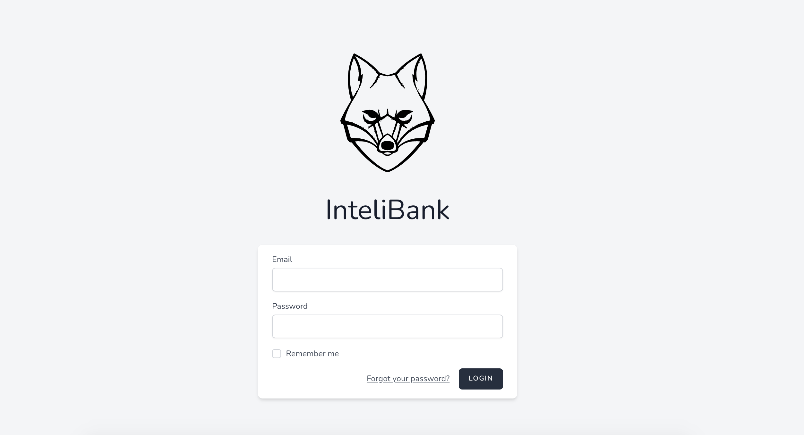
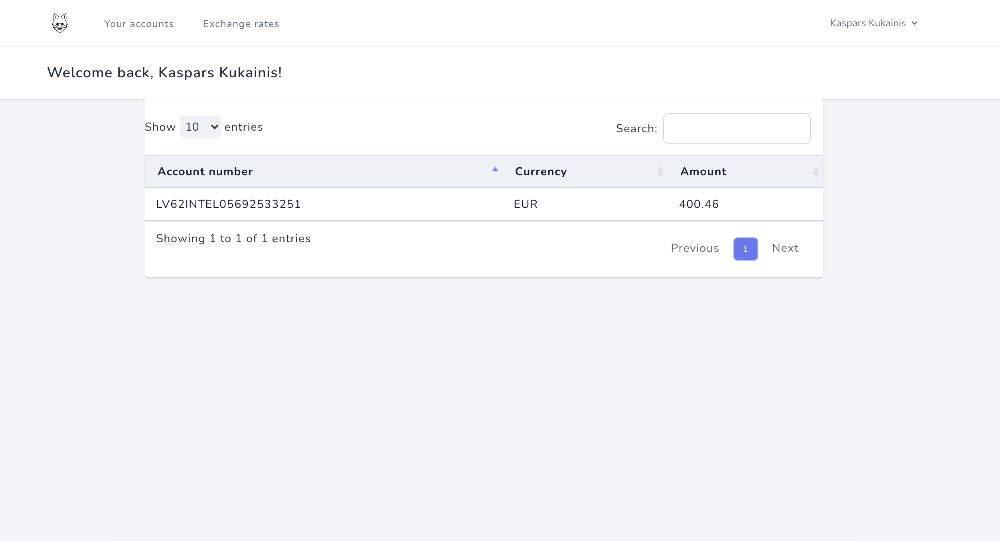
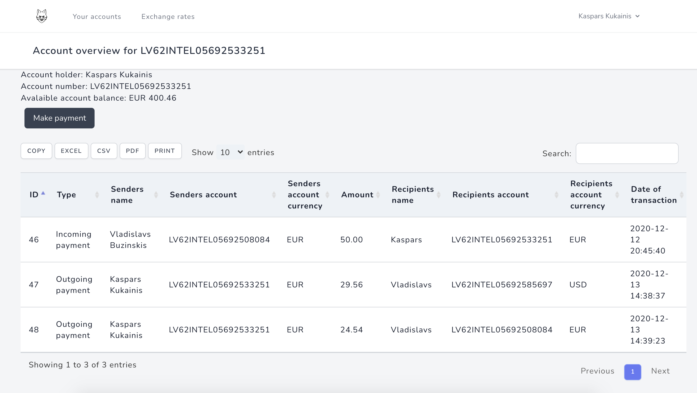
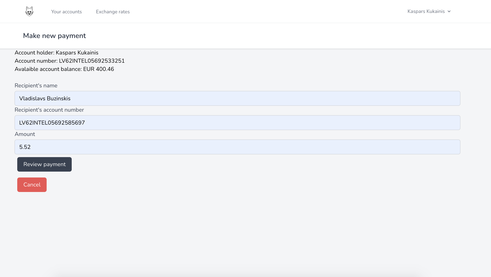
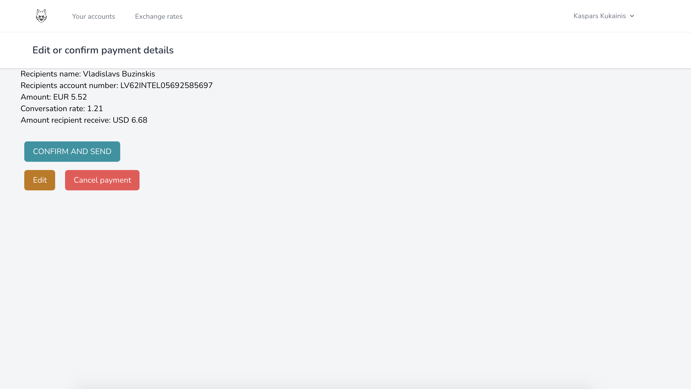

# InteliBank

A simple e-banking system written with PHP 7.4 using Laravel 8 framework.
The project simulates real-time transactions. Supports transactions between different currencies.
Real time currency conversion.
Extensive use of events, services, repositories and scheduled cron jobs.

## Login page

## User accounts

## Acount details

## Recipient's details screen

## Payment overview

